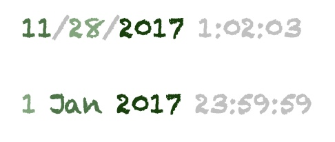
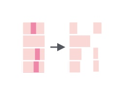
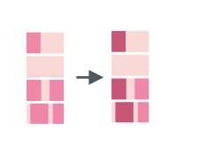
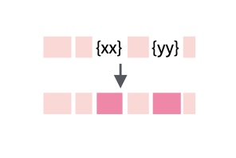
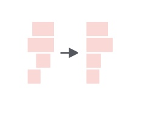

```{r setup, include=FALSE}
options(htmltools.dir.version = FALSE)
```

# Outline
1. Text as Data in R
--
<br>

2. String Processing in the Political Sciences
--
<br>

3. Introducing Stringi & Friends
--
<br>

4. Key Features & Use Cases
--
<br>

5. Match Made in Heaven: Stringi & Regex
--
<br>

6. Further Resources 

---
#Text as Data in R
##Significance of text data in the context of Data Science
- Ever heard of the term, Natural Language Processing or NLP?
--
  - To put it simply, NLP is a field concerned with extracting insights based on interactions between computer and human interactions.
  - Textual analysis is at the heart of such an analysis. But most of the text data is unstructured and not so analysis friendly.
  - But ultimately text is data! Stringology (Crochemore and Rytter 2003) deals with algorithms and data structures for character string processing (Jurafsky and Martin 2008; Szpankowski 2001)
  - Most statistical computing ecosystems provide only a basic set of text operations. In R, however, tools such as stringi and stringr provide researchers and analysts with the ability to efficiently manipulate, clean, and analyze text data.
  - These tools help drive a wide variety of applications. E.g: Extracting specific information from text, such as named entities (persons, locations), dates, and relations between entities.

---

- Example of text data in R:
--
  - text_as_vector<- c("NLP is a subfield of artificial intelligence", "Text data is crucial for analysis.")
  - text_with_special_characters<-"Check out #RStats and #DataScience!"
  - text_with_uneven_spaces<-"All code chunk   outputs  presented in this paper   were  obtained in   R 4.1.2." 

##Common Forms of Textual Data Analysis:

- Data cleaning and preprocessing

- Pattern matching

- Multilingual text handling

---

#String Processing in the Political Sciences
- In political science, working with large-scale textual data has become increasingly important.

  - Political speeches, manifestos, and debates
  - Social media and news articles
  - Surveys and interviews

- Regular expression is a powerful tool that makes it easier to search for specific terms, party names, or policy mentions in large corpus.

  - text <- c("The 2020 election results are being contested mainly on the issue of growing pollution and water crisis in the cities.")
  -Here, the terms like air pollution and water crisis can be of interest to the researchers studying agenda-setting process.

- Political science research often involves text in multiple languages. Libraries in R can handle different character sets, ensuring correct processing of text in non-Latin scripts.

  - multi_text <- "This is in English. 这是中文."
  - Here, you would want to separate the scripts to process the data

---

#String Processing in the Political Sciences

By analyzing data from social media (e.g., Twitter, Facebook), news outlets, and online forums, researchers can gain real-time insights into voter sentiment, election campaigns, or the popularity of government actions.

- Example

  - senator_speech <- ""As we approach the next election, it is critical to recognize the progress we have made, but we must also acknowledge the severe shortcomings in our healthcare and education systems.I am optimistic that with the right leadership, we can build a brighter future.
  - positive_words <- c("bright", "great", "excellent", "good")
  - positive_pattern <- paste(positive_words, collapse = "|")
  - positive_mentions <- stri_extract_all_regex(speech, positive_pattern)

---

#Introducing `stringi` & Friends
##String processing in the tidyverse
<div class="logo-right">
  
</div>

- unlike `base`, `stringi`follows a `tidyverse`-syntax
--

- most comprehensive string processing package (250 functions)
--

  - commands begin with `stri`
  - less accessible, but can handle advanced tasks
  - relies on International Components for Unicode (ICU) 
- `stringr`: based on `stringi`
--

  - more accessible, but "only" 49 functions
  - commands begin with `str`


---
#Introducing `stringi` & Friends
##Why you should use `stringi`
<div class="logo-right">
  
</div>

- `stringi` supports [Unicode](https://home.unicode.org) ➡️ can process text & date data in different locales which is important for working data with from different countries. E.g.:
--

  - "ä" is interpreted as "ae"
  - Japanese date notation can be parsed in German R 
--

- the most versatile string-processing package
--

  - if you are struggling to achieve your goals with `base`or `stringr`, take a look at `stringi`resources (e.g. [this](https://www.rdocumentation.org/packages/stringi/versions/1.8.4) or [this](https://stringi.gagolewski.com/index.html)) 

---
#Key Features & Use Cases 

.pull-left[
**1. Working with temporal data from different locales:** 
<br>
use `stri_datetime_parse`to homogenize temporal data.
<br>
*Example*: You scraped flight schedules from different countries and want to homogenize the notation of time and date.
<br>


]

--
.pull-right[

**2. General Transforms:** <br>
use `stri_trans_general` to transliterate characters from one script to another script of your choosing.
<br>
*Example*: You might be working with data  from a foreign local and the special characters are not displaying well. You can use `stri_trans_general` to convert them to Latin-ASCII. 
```{r}
library("stringi")
stri_trans_general("Dämliche Düsen lärmen prächtig", "latin-ascii")
````
]

---
#Key Features & Use Cases continued
.pull-left[

<br>
**3. Text Boundary Analysis:**<br>
To split text into lines/words/characters, count characters or locate particular text units (e.g. the 4th word of a sentence), use commands like `stri_count_boundares`, `stri_split_boundaries` or `stri_locate_boundaries`. 
<br>
*Example*: To prepare text data for a bag of words analysis ➡️ use `stri_split_boundaries`to split the text into words.
]

--

.pull-right[
<br>
**4. Extracting & Replacing Substrings:** <br>
use `stri_sub`to extract and replace substrings.
<br>
*Example*: If you have a data set with telephone numbers and want to standardize them  or want to extract information like country or area code. It is also handy for anonymizing personal data.
]


---
#Key Features & Use Cases continued
.pull-left[


<br>
**5. Concatenating Strings:** <br>
to run concatenation-based operations, use `stri_join`, `stri_dup`, %s+%, or `stri_flatten`.
<br>
*Example*: You might want to create a key for observations by concatenating multiple variables. It is also helpful for building URLs when scraping. 
]

--
.pull-right[

<br>
**6. Trimming:** <br>
to remove uneccessary white spaces, use `stri_trim`.
<br>
*Example*: You've scraped text from the web and need to remove superfluous white spaces at the beginning and/or end of the strings. 
]

---
#Match Made in Heaven: Stringi & Regex

##Portability and Versatility

- As Stringi is an extension of Stringr with Unicode standards, it uses the same regex syntax for pattern matching, subsetting, and any other textual analysis. 

--
- Regex allows for a variety of operations: subsetting, cleaning, pattern matching, text substitution and replacement, case conversion

--

##Major Functions:

--
- stri_detect_regex() – Detecting Patterns in Text
- stri_extract_all_regex() – Extracting Matching Substrings
- stri_replace_all_regex() – Replacing Patterns
- stri_count_regex() – Counting Matches in Text
- stri_split_regex() – Splitting Text by Pattern
- stri_match_all_regex() – Extracting Groups of Matches
- stri_locate_all_regex() – Locating Pattern Matches
--

---

#Match Made in Heaven: Stringi & Regex

##Case Study

- speeches_Labour_Party<- c(
  "The economy is growing, but unemployment remains a challenge. We must improve jobs.",
  "Our education system needs reform. Healthcare must be accessible to everyone.",
  "Job creation is our top priority to strengthen the economy. We will invest in education.",
  "The unemployment rate is decreasing, but healthcare services are underfunded."
)

#Steps to Analyse these statements

- Defining regex terms:
  - economic_terms <- "\\beconomy\\b|\\bjobs\\b|\\bunemployment\\b|\\bjob creation\\b"
  - social_terms <- "\\bhealthcare\\b|\\beducation\\b|\\breform\\b"

- Searching for Mentions in the speeches
  - economic_mentions <- stri_detect_regex(speeches, economic_terms)
  - social_mentions <- stri_detect_regex(speeches, social_terms)

---

#Match Made in Heaven: Stringi & Regex

- Count the number of mentions
  - economic_count <- sum(economic_mentions)
  - social_count <- sum(social_mentions)

- Count and print the occurrences of terms in each speech
  - economic_count_per_speech<-stri_count_regex(speeches, economic_terms)
  - social_count_per_speech<-stri_count_regex(speeches, social_terms)
  - data.frame(Speech = 1:length(speeches), Economic_Count = economic_count_per_speech, Social_Count = social_count_per_speech)

---

#Further Resources
If you're interested in learning more about `stringi`, feel free to check out the following resources: 

- [Overview of key functions 1](https://www.rdocumentation.org/packages/stringi/versions/1.8.4/topics/about_stringi)
- [Overview of key functions 2](https://stringi.gagolewski.com/index.html#)
- [CRAN entry](https://cran.r-project.org/web/packages/stringi/index.html)
- [Paper by the package's author](https://www.google.com/url?sa=t&source=web&rct=j&opi=89978449&url=https://www.jstatsoft.org/article/view/v103i02/4324&ved=2ahUKEwjznajP1qKJAxUN9AIHHR-AH0oQFnoECB4QAQ&usg=AOvVaw2ysoUKJIt6sqvLBgWUotez)
- [Documentation](https://www.rdocumentation.org/packages/stringi/versions/1.8.4)
- [`stringi`Github repo](https://github.com/gagolews/stringi)

---
#Image Credits
- [`stringi`logo](https://www.google.com/url?sa=i&url=https%3A%2F%2Fstringi.gagolewski.com%2F&psig=AOvVaw3_xTop87NlWBu_Ek9kc9A6&ust=1729697796955000&source=images&cd=vfe&opi=89978449&ved=0CBEQjRxqFwoTCNDOmMmoookDFQAAAAAdAAAAABAE) 


